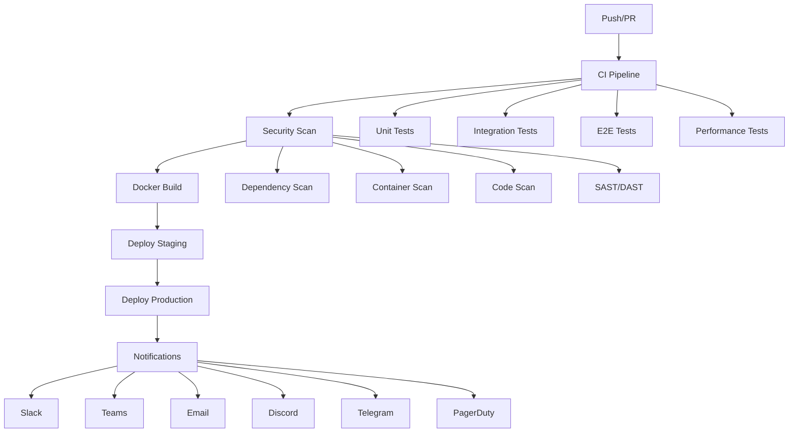
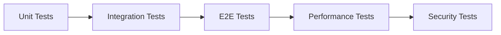
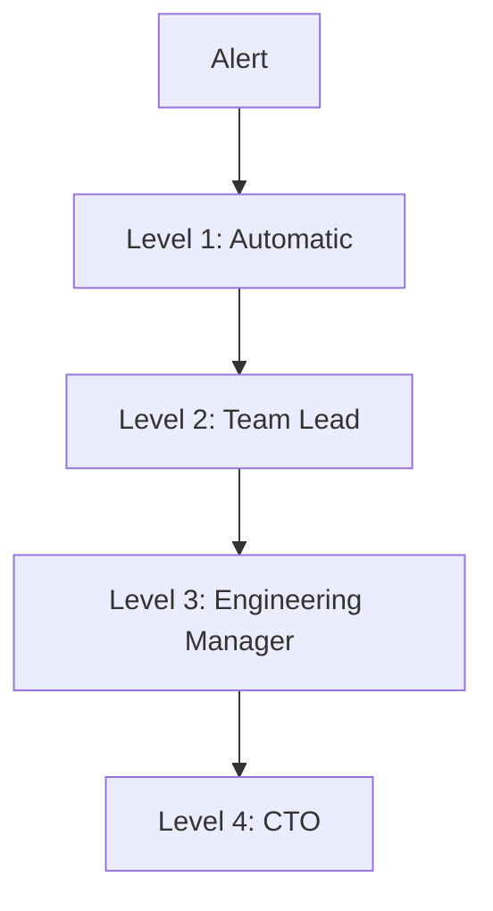

# 🚀 CI/CD Pipeline - AI News Aggregator

## 📋 Descripción General

Este pipeline CI/CD proporciona una solución completa de integración y despliegue continuo para el proyecto AI News Aggregator, incluyendo testing automatizado, builds de contenedores, escaneo de seguridad, despliegues a staging y producción, y sistema completo de notificaciones.

## 🏗️ Arquitectura del Pipeline



## 🗂️ Componentes del Pipeline

### 1. 📋 Continuous Integration (`ci.yml`)

**Trigger**: Push a `main`, `develop` o Pull Request

**Funcionalidades**:
- ✅ **Code Quality**: Linting, formatting, type checking
- 🧪 **Backend Tests**: Unit, Integration, Coverage
- ⚛️ **Frontend Tests**: Lint, TypeScript, Unit, E2E
- 🎭 **End-to-End Tests**: Full application testing
- ⚡ **Performance Tests**: Load and benchmark testing
- 📦 **Container Build Test**: Verify Docker builds

**Salidas**:
- Test reports
- Coverage reports
- Build artifacts
- Quality metrics

### 2. 🔒 Security Scan (`security-scan.yml`)

**Trigger**: Push, PR, schedule (daily 2 AM), manual

**Funcionalidades**:
- 🔐 **Dependency Scan**: Safety, pip-audit
- 🐳 **Container Scan**: Trivy image scanning
- 🛡️ **Code Security**: Bandit, Semgrep
- 🔍 **SAST**: CodeQL analysis
- 🌐 **DAST**: Dynamic security testing
- 🏗️ **Infrastructure Scan**: Docker, K8s security

**Salidas**:
- Security reports (SARIF, JSON)
- Vulnerability summaries
- CodeQL alerts

### 3. 📦 Docker Build (`docker-build.yml`)

**Trigger**: Push, tags, PR, manual

**Funcionalidades**:
- 🏗️ **Multi-stage Builds**: Optimized container images
- 🌍 **Multi-platform**: AMD64, ARM64
- 🔍 **Image Testing**: Health checks, functionality tests
- 🔒 **Security Scanning**: Trivy integration
- 🏷️ **Tagging**: Semantic versioning, branch-based
- ☁️ **Registry Push**: GitHub Container Registry

**Estrategias de Build**:
- Backend: Python 3.11, optimized layers
- Frontend: Node 18, production builds
- Multi-stage: Smaller final images

### 4. 🧪 Deploy to Staging (`deploy-staging.yml`)

**Trigger**: Push a `develop`

**Funcionalidades**:
- 🔵 **Blue-Green Deployment**: Zero-downtime deploys
- 🔄 **Rolling Updates**: Standard deployments
- 🛡️ **Pre-deployment Checks**: Validation
- 🧪 **Smoke Tests**: Post-deployment verification
- 📊 **Monitoring Setup**: Prometheus integration
- 🔄 **Rollback Capability**: Quick recovery

**Features**:
- Database migrations
- Environment isolation
- Health monitoring
- Performance validation

### 5. 🚀 Deploy to Production (`deploy-production.yml`)

**Trigger**: Push a `main` o tags `v*`

**Funcionalidades**:
- 🔵 **Blue-Green Deployment**: Zero-risk releases
- 🟡 **Canary Deployment**: Gradual rollouts
- 🔄 **Rolling Updates**: Traditional deployments
- 🔍 **Production Smoke Tests**: Critical path validation
- 📊 **Monitoring**: Full observability stack
- 🔄 **Auto-rollback**: Automatic failure recovery

**Safety Features**:
- Manual approval
- Pre-deployment checklist
- Database migration validation
- Automatic rollback triggers

### 6. 📢 Notifications (`notification.yml`)

**Trigger**: Workflow completion (all pipelines)

**Funcionalidades**:
- 💬 **Slack**: Real-time notifications
- 📢 **Microsoft Teams**: Channel integration
- 📧 **Email**: SMTP alerts
- 🎮 **Discord**: Community notifications
- 📱 **Telegram**: Mobile alerts
- 🚨 **PagerDuty**: Critical incident management

**Alert Channels**:
- Success/Failure notifications
- Environment-specific routing
- Severity-based alerting
- Rich message formatting

### 7. 🌍 Environment Setup (`environment-setup.yml`)

**Trigger**: Manual, validación inicial

**Funcionalidades**:
- ✅ **Validation**: Configuration verification
- 🏗️ **Setup**: Kubernetes namespace provisioning
- 🧹 **Cleanup**: Environment destruction
- 🔐 **Secrets Management**: Secure configuration
- 🛡️ **RBAC Setup**: Access control
- 🌐 **Network Policies**: Security isolation

## 🚀 Uso del Pipeline

### Triggers Automáticos

```yaml
# En cada push a main/develop
- Pruebas automatizadas
- Builds de contenedores
- Despliegues a staging

# En cada push a main o tag v*
- Despliegue a producción
- Notificaciones de release

# En Pull Requests
- Validación completa
- Previews de builds
- Comentarios automáticos
```

### Triggers Manuales

```bash
# Deploy manual a staging
gh workflow run deploy-staging.yml -f deployment_type=blue-green

# Deploy manual a producción
gh workflow run deploy-production.yml -f deployment_type=canary -f force_deploy=false

# Configuración de environment
gh workflow run environment-setup.yml -f action=setup -f environment=staging

# Security scan manual
gh workflow run security-scan.yml -f scan_type=full
```

### Variables de Entorno Principales

```bash
# Registries
REGISTRY=ghcr.io
BACKEND_IMAGE_NAME=username/ai-news-aggregator-backend
FRONTEND_IMAGE_NAME=username/ai-news-aggregator-frontend

# Environments
STAGING_URL=https://staging.ainews.example.com
PRODUCTION_URL=https://ainews.example.com

# Security
SECURITY_SCAN_ENABLED=true
DEPENDENCY_SCAN_ENABLED=true
CONTAINER_SCAN_ENABLED=true
```

## 🔐 Configuración de Secrets

### Secrets Requeridos

```bash
# Kubernetes Configuration
STAGING_KUBECONFIG=<base64-encoded-kubeconfig>
PRODUCTION_KUBECONFIG=<base64-encoded-kubeconfig>

# Database URLs
STAGING_DATABASE_URL=postgresql+asyncpg://...
PRODUCTION_DATABASE_URL=postgresql+asyncpg://...

# Redis URLs
STAGING_REDIS_URL=redis://...
PRODUCTION_REDIS_URL=redis://...

# API Keys
OPENAI_API_KEY=sk-...
ANTHROPIC_API_KEY=...

# Notifications
SLACK_WEBHOOK_URL=https://hooks.slack.com/...
TEAMS_WEBHOOK_URL=https://outlook.office.com/...
DISCORD_WEBHOOK_URL=https://discord.com/api/webhooks/...
TELEGRAM_BOT_TOKEN=...
TELEGRAM_CHAT_ID=...

# Email Configuration
EMAIL_FROM=noreply@domain.com
EMAIL_TO=alerts@domain.com
EMAIL_SMTP_SERVER=smtp.gmail.com
EMAIL_SMTP_PORT=587
EMAIL_USERNAME=username@gmail.com
EMAIL_PASSWORD=app-password

# Critical Alerts
PAGERDUTY_INTEGRATION_KEY=...
```

### Configuración Paso a Paso

1. **Navegar a Settings > Secrets and variables > Actions**
2. **Agregar Repository Secrets**:
   ```bash
   STAGING_KUBECONFIG=<kubectl get configmap kubeconfig -o yaml | base64 -w 0>
   PRODUCTION_KUBECONFIG=<kubectl get configmap kubeconfig -o yaml | base64 -w 0>
   ```

3. **Agregar Repository Variables**:
   ```bash
   REGISTRY=ghcr.io
   BACKEND_IMAGE_NAME=your-username/ai-news-aggregator-backend
   ```

## 🛡️ Estrategias de Deployment

### Blue-Green Deployment

```yaml
strategy:
  type: RollingUpdate
  rollingUpdate:
    maxSurge: 1
    maxUnavailable: 0
```

**Flujo**:
1. Deploy a "green" environment
2. Run smoke tests
3. Switch traffic to green
4. Monitor for issues
5. Keep "blue" as rollback option

### Canary Deployment

```yaml
strategy:
  canary:
    steps:
    - setWeight: 10    # 10% traffic
    - pause: {duration: 30s}
    - setWeight: 50    # 50% traffic
    - pause: {duration: 60s}
    - setWeight: 100   # 100% traffic
```

**Ventajas**:
- Gradual rollout
- Real user testing
- Easy rollback
- Minimal risk

### Rolling Update

**Flujo**:
1. Update 1 pod at a time
2. Wait for health check
3. Continue with next pod
4. Full replacement

## 🔄 Estrategias de Rollback

### Automático

```bash
# Triggers automáticos
- Health check failures
- Response time > 5s
- Error rate > 10%
- Database migration failures
```

### Manual

```bash
# Rollback comandos
kubectl rollout undo deployment/ai-news-backend -n production

# Rollback a revisión específica
kubectl rollout undo deployment/ai-news-backend --to-revision=2 -n production
```

## 📊 Monitoreo y Alertas

### Métricas Clave

- **Uptime**: Availability targets
- **Response Time**: P95 < 500ms
- **Error Rate**: < 0.1%
- **Throughput**: > 1000 req/s
- **Coverage**: > 80%

### Alertas Configuradas

```yaml
# Critical (PagerDuty)
- Production deployment failures
- Security vulnerabilities
- Database connectivity issues

# Warning (Slack/Email)
- Staging deployment failures
- Performance degradation
- Coverage below threshold

# Info (Discord/Telegram)
- Successful deployments
- CI pipeline completions
- Security scan results
```

## 🧪 Testing Strategy

### Niveles de Testing



1. **Unit Tests**: Función individual
2. **Integration Tests**: Componentes integrados
3. **E2E Tests**: Flujo completo de usuario
4. **Performance Tests**: Carga y stress
5. **Security Tests**: Vulnerabilidades

### Coverage Requirements

- **Backend**: ≥ 80%
- **Frontend**: ≥ 75%
- **Overall**: ≥ 80%

## 🚨 Troubleshooting

### Problemas Comunes

#### 1. Permisos de Kubernetes

```bash
# Verificar RBAC
kubectl auth can-i create deployments --as=system:serviceaccount:default:github-actions -n production

# Verificar secrets
kubectl get secrets -n production
```

#### 2. Builds de Contenedores

```bash
# Verificar imágenes
docker pull ghcr.io/username/ai-news-aggregator-backend:latest

# Logs de build
docker logs <container-id>
```

#### 3. Conectividad de Base de Datos

```bash
# Test de conectividad
kubectl exec -it <pod> -- python -c "
import asyncpg
import asyncio
async def test():
    conn = await asyncpg.connect('postgresql://...')
    await conn.execute('SELECT 1')
asyncio.run(test())
"
```

### Logs del Pipeline

```bash
# Ver logs de workflow
gh run view <run-id> --log

# Descargar artifacts
gh run view <run-id> --artifact

# Re-run fallido
gh run rerun <run-id>
```

## 📈 Métricas y Dashboard

### Grafana Dashboards

- **Application Metrics**: Response times, throughput
- **Infrastructure Metrics**: CPU, memory, disk
- **Business Metrics**: User engagement, articles processed
- **Security Metrics**: Vulnerability trends

### Prometheus Alerts

```yaml
groups:
- name: ai-news-alerts
  rules:
  - alert: HighErrorRate
    expr: rate(http_requests_total{status=~"5.."}[5m]) > 0.1
    for: 2m
    labels:
      severity: critical
```

## 🔒 Seguridad

### Security Best Practices

1. **Least Privilege**: Mínimos permisos necesarios
2. **Secret Rotation**: Rotación regular de credenciales
3. **Network Isolation**: Políticas de red restrictivas
4. **Image Scanning**: Escaneo de vulnerabilidades
5. **Dependency Updates**: Actualizaciones regulares

### Compliance

- **GDPR**: Manejo de datos personales
- **SOC2**: Controles de seguridad
- **PCI DSS**: Si se manejan pagos

## 📞 Soporte

### Contactos

- **On-Call**: PagerDuty rotation
- **Slack**: #devops-support
- **Email**: devops@company.com

### Escalación



## 📚 Recursos Adicionales

### Documentación

- [GitHub Actions Documentation](https://docs.github.com/en/actions)
- [Kubernetes Documentation](https://kubernetes.io/docs/)
- [Docker Best Practices](https://docs.docker.com/develop/dev-best-practices/)

### Herramientas

- **kubectl**: Kubernetes CLI
- **helm**: Package manager
- **terraform**: Infrastructure as Code
- **prometheus**: Monitoring
- **grafana**: Dashboards

## 🔄 Mantenimiento

### Tareas Regulares

- **Semanal**: Review security scans
- **Mensual**: Update dependencies
- **Trimestral**: Review security policies
- **Anual**: Audit permissions

### Actualizaciones

```bash
# Update GitHub Actions versions
npm update -g @github/actions-cli

# Update container base images
docker pull python:3.11-slim
docker pull node:18-alpine

# Update Kubernetes cluster
kubectl version --short
```

## 🎯 Mejora Continua

### Métricas de Éxito

- **Deployment Frequency**: > 1/day
- **Lead Time**: < 1 day
- **MTTR**: < 30 minutes
- **Change Failure Rate**: < 5%

### Objetivos

- [ ] Zero-downtime deployments
- [ ] 99.9% uptime
- [ ] < 100ms response time
- [ ] 100% test coverage

---

📝 **Actualizado**: $(date +%Y-%m-%d)

Para más detalles, consultar:
- `.github/PIPELINE-CONFIG.md` - Configuración detallada
- `.github/workflows/` - Workflows específicos
- Archivos de documentación en `/docs/`